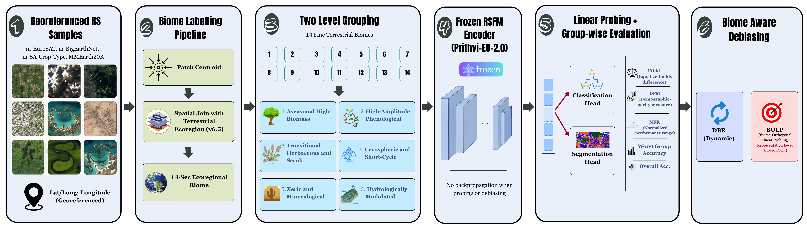
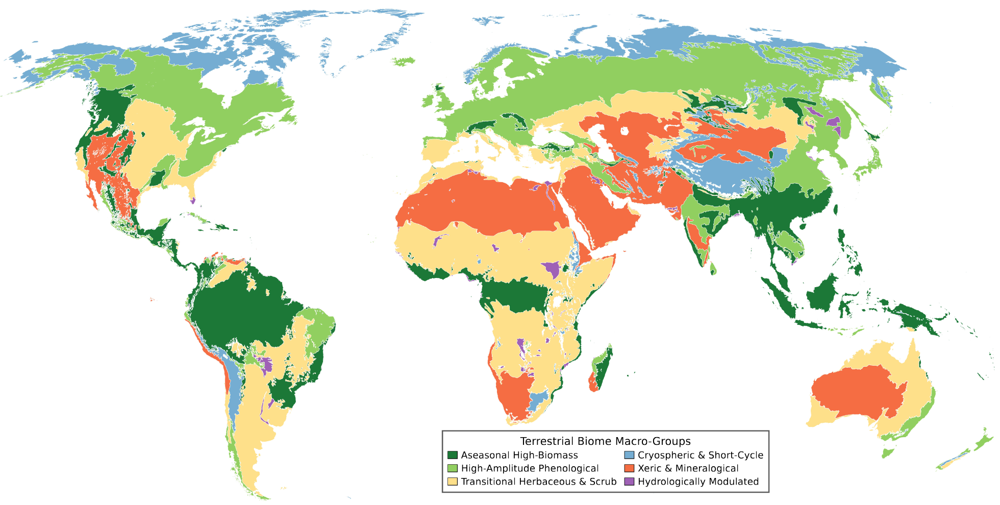
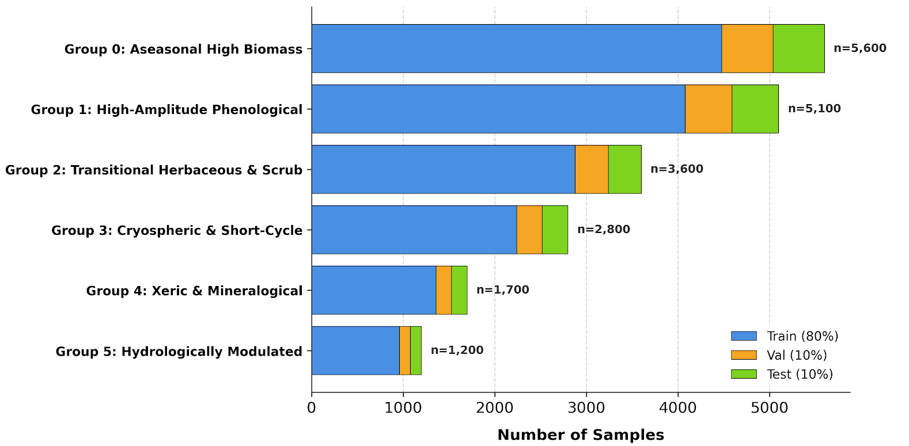

<div align="center">

<h1>FairRSFM: A Biome-Aware Benchmark and Debiasing Framework for Remote Sensing Foundation Models</h1>

**Author list and affiliations will be added with the public paper release.**

<p>
  <a href="https://arxiv.org/abs/XXXX.XXXXX"></a>
  <a href="https://huggingface.co/datasets/aminurhossain/FairRSFM"></a>
  <a href="https://github.com/aminurhossain/FairRSFM"></a>
</p>

**[Overview](#overview) | [Benchmark](#benchmark) | [Methods](#debiasing-methods) | [Results](#headline-results) | [Code](#code-and-release-status) | [Documentation](#documentation) | [Citation](#citation)**

</div>

<p align="center">
  
</p>

> **TL;DR:** Aggregate RSFM scores can hide large ecological performance gaps. FairRSFM assigns georeferenced samples to terrestrial biomes, consolidates them into six remote-sensing-relevant macro-groups, and evaluates frozen foundation models with worst-group, calibration, and parity metrics. It also benchmarks biome-aware mitigation through DBR, BOLP, and GroupDRO.

## News

- **Coming soon:** FairRSFM paper on arXiv.
- **Coming soon:** FairRSFM benchmark metadata and dataset release on Hugging Face.
- **Coming soon:** Preprocessing, training, debiasing, and evaluation code.
- **Available now:** Project overview, protocol documentation, complete paper results, architecture, and biome figures.

## Overview

Remote sensing foundation models (RSFMs) are normally compared using aggregate accuracy, macro-F1, or mIoU. These averages do not show whether a model transfers consistently across forests, grasslands, drylands, cryospheric regions, and water-influenced ecosystems.

**FairRSFM** turns standard downstream transfer into an ecological group-robustness benchmark:

1. Assign each georeferenced sample to one of **14 terrestrial biomes** using its patch centroid and an external ecoregion map.
2. Consolidate sparse biome classes into **six ecologically meaningful macro-groups**.
3. Evaluate **three frozen RSFM backbones** on **four classification and segmentation datasets**.
4. Report standard task performance together with worst-group, calibration, and cross-group disparity metrics.
5. Compare ERM with loss-level, representation-level, and group-robust mitigation strategies.

### What FairRSFM contributes

- A reusable biome-labeling and metadata protocol for georeferenced remote sensing datasets.
- A two-level ecological taxonomy that preserves 14 raw biome labels while using six stable macro-groups for primary evaluation.
- A controlled frozen-encoder benchmark spanning single-label classification, multi-label classification, and semantic segmentation.
- **Dynamic Biome Reweighting (DBR)**, which adapts group weights from validation feedback.
- **Biome-Orthogonal Linear Probing (BOLP)**, which removes dominant biome-associated directions from frozen embeddings without updating the backbone.
- Complete reporting of task performance, worst-group robustness, calibration, equalized-odds disparity, and demographic-parity disparity.

## Project at a Glance

| Component | Scope |
|---|---:|
| Raw terrestrial biomes | 14 |
| Ecological macro-groups | 6 |
| Downstream datasets | 4 |
| Frozen RSFM backbones | 3 |
| Training strategies | 4 |
| Independent random seeds | 3 |

## Benchmark

### Downstream tasks

| Dataset | Task | Classes | Train | Val | Test | Primary metric |
|---|---|---:|---:|---:|---:|---|
| m-EuroSAT | Single-label land-cover classification | 10 | 2,000 | 1,000 | 1,000 | Macro-F1 |
| m-BigEarthNet | Multi-label land-cover classification | 43 | 20,000 | 1,000 | 1,000 | F1@opt |
| m-SA-Crop-Type | Crop-type segmentation | 10 | 3,000 | 1,000 | 1,000 | mIoU |
| MMEarth20K | Dynamic World land-cover segmentation | 9 | 16,000 | 2,000 | 2,000 | mIoU |

### Frozen foundation models

| Backbone | Architecture | Parameters | Embedding | Input configuration |
|---|---|---:|---:|---|
| Prithvi-EO-2.0 | Spatio-temporal ViT | 300M | 1024 | 6 HLS bands |
| SatMAE | ViT-Large | 304M | 1024 | 10 Sentinel-2 bands |
| DOFA | ViT-Base | 86M | 768 | 9-12 wavelength-conditioned bands |

All encoders remain frozen. Only a classification probe or lightweight segmentation decoder is trained. Experiments use 224 x 224 inputs, AdamW with cosine scheduling, 50 epochs, validation-based checkpoint selection, and three random seeds.

See **[Benchmark and experimental protocol](docs/benchmark.md)** for full configuration details.

## Biome-Aware Evaluation

<p align="center">
  
</p>

| ID | Macro-group | Raw biome IDs | Dominant remote sensing regime |
|---:|---|---|---|
| 1 | Aseasonal High-Biomass | 1, 3, 5 | Persistent dense forest canopy |
| 2 | High-Amplitude Phenological | 2, 4, 6 | Strong seasonal forest dynamics |
| 3 | Transitional Herbaceous and Scrub | 7, 8, 12 | Mixed grass, shrub, soil, and canopy signals |
| 4 | Cryospheric and Short-Cycle | 10, 11 | Temperature-limited and short growing cycles |
| 5 | Xeric and Mineralogical | 13 | Sparse vegetation, exposed soil, and mineral background |
| 6 | Hydrologically Modulated | 9, 14 | Water-driven spectral response and inundation |

<p align="center">
  
  <br>
  <sub>MMEarth20K composition across macro-groups and the 80/10/10 train, validation, and test splits.</sub>
</p>

See **[Biome taxonomy and labeling](docs/biome-groups.md)** for the complete 14-class mapping, rationales, metadata schema, and split counts.

## Debiasing Methods

| Method | Intervention | Description | Backbone updates | Extra trainable parameters |
|---|---|---|---:|---:|
| ERM | Baseline | Standard task loss on frozen RSFM features | No | No |
| DBR | Loss level | Dynamically reweights below-mean biome groups using validation feedback | No | No |
| BOLP | Representation level | Recenters group embeddings and projects out dominant biome-associated directions | No | No |
| GroupDRO | Objective level | Optimizes group-robust performance across active biome groups | No | No |

BOLP estimates the inter-group subspace from training embeddings, forms the orthogonal projector `P_k = I - U_k U_k^T`, and transforms each embedding as `z_hat = P_k(z - mu_g + mu_0)` before fitting the downstream head.

See **[Methods and evaluation metrics](docs/methods.md)** for the full DBR update rule, BOLP derivation, inference behavior, and metric definitions.

## Headline Results

The table summarizes the mean performance over three seeds. `ERM O/W` denotes the original ERM overall and worst-group scores. The last two columns show the strongest overall and worst-group scores among all evaluated methods for each backbone and dataset.

| Backbone | Dataset | ERM O/W | Best overall | Best worst-group |
|---|---|---:|---:|---:|
| Prithvi-EO-2.0 | m-EuroSAT | 90.98 / 83.72 | **94.14** (GroupDRO) | **84.35** (DBR) |
|  | m-BigEarthNet | 60.09 / 46.12 | **62.75** (BOLP) | **50.27** (BOLP) |
|  | m-SA-Crop-Type | 27.30 / 18.47 | **28.27** (BOLP) | **19.81** (DBR) |
|  | MMEarth20K | 47.99 / 33.75 | **47.99** (ERM) | **37.16** (GroupDRO) |
| SatMAE | m-EuroSAT | 93.89 / 74.45 | **93.89** (ERM) | **89.71** (GroupDRO) |
|  | m-BigEarthNet | 53.30 / 41.33 | **53.30** (ERM) | **43.07** (BOLP) |
|  | m-SA-Crop-Type | 28.01 / 18.07 | **28.79** (DBR) | **19.23** (DBR) |
|  | MMEarth20K | 41.93 / 30.78 | **42.39** (DBR) | **32.74** (DBR) |
| DOFA | m-EuroSAT | 89.63 / 79.88 | **90.98** (DBR) | **88.27** (DBR) |
|  | m-BigEarthNet | 47.67 / 37.90 | **47.67** (ERM) | **38.74** (GroupDRO) |
|  | m-SA-Crop-Type | 27.40 / 19.91 | **28.20** (DBR) | **21.91** (DBR) |
|  | MMEarth20K | 39.67 / 27.64 | **39.67** (ERM) | **28.54** (DBR) |

### Main findings

- **Aggregate scores hide ecological gaps.** Prithvi-EO-2.0 reaches 60.09 F1@opt on m-BigEarthNet, but its worst biome group falls to 46.12.
- **BOLP is particularly effective for Prithvi classification.** On m-BigEarthNet it improves overall F1@opt from 60.09 to 62.75, worst-group performance from 46.12 to 50.27, and NFR from 31.14 to 20.92.
- **Group-robust optimization can recover large gaps.** SatMAE GroupDRO raises the m-EuroSAT worst-group score from 74.45 to 89.71.
- **DBR is consistently useful across backbones.** It provides the best worst-group result for both segmentation tasks with SatMAE and DOFA.
- **Mitigation is task dependent.** BOLP improves classification robustness but can remove biome variation that remains task-relevant for dense land-cover prediction.

See **[Complete results](docs/results.md)** for every global metric, all mean and standard-deviation values, biome-wise classification and segmentation tables, interpretation, and limitations.

## Evaluation Metrics

FairRSFM reports three complementary metric tiers:

1. **Task performance:** Macro-F1, F1@opt, and mIoU.
2. **Group robustness:** worst-group score and normalized failure range (NFR).
3. **Calibration and parity:** expected calibration error (ECE), equalized-odds disparity (EOdd), and demographic-parity metric (DPM).

Unknown, water-only, or unmatched samples are reported separately and excluded from primary worst-group summaries unless stated otherwise.

## Documentation

| Document | Contents |
|---|---|
| [Benchmark protocol](docs/benchmark.md) | Datasets, sample counts, metadata, backbones, heads, and optimization |
| [Biome taxonomy](docs/biome-groups.md) | 14 raw biomes, six macro-groups, rationales, labeling, and distributions |
| [Methods and metrics](docs/methods.md) | DBR, BOLP, GroupDRO, task metrics, robustness, calibration, and parity |
| [Complete results](docs/results.md) | All Prithvi, SatMAE, DOFA, and biome-wise results from the paper |

## Code and Release Status

The repository now provides the public package and experiment layout. The
implementation and reproducible configurations are being prepared for release;
the current tree does not claim executable training code.

| Component | Status | Planned location |
|---|---|---|
| Project documentation and reported results | Available | This repository |
| Paper | Coming soon | [arXiv placeholder](https://arxiv.org/abs/XXXX.XXXXX) |
| Benchmark metadata and dataset | Coming soon | [Hugging Face placeholder](https://huggingface.co/datasets/aminurhossain/FairRSFM) |
| Preprocessing and biome-labeling code | In preparation | [`src/fairrsfm/`](src/fairrsfm/) |
| Training and mitigation code | In preparation | [`src/fairrsfm/`](src/fairrsfm/) |
| Evaluation scripts and configs | In preparation | [`experiments/`](experiments/) |
| License | To be confirmed before code and data release | This repository |

## Repository Structure

```text
FairRSFM/
|-- .gitignore
|-- README.md
|-- assets/
|   |-- fairrsfm-architecture.png
|   |-- global-biome-macro-groups.png
|   `-- macro-group-distribution.png
|-- docs/
|   |-- benchmark.md
|   |-- biome-groups.md
|   |-- methods.md
|   `-- results.md
|-- experiments/
|   |-- README.md
|   |-- configs/
|   |   |-- backbones/
|   |   |-- datasets/
|   |   |-- methods/
|   |   `-- tasks/
|   `-- outputs/
`-- src/
    |-- README.md
    `-- fairrsfm/
        |-- biomes/
        |-- data/
        |-- evaluation/
        |-- methods/
        |-- models/
        `-- training/
```

## Citation

The citation will be updated with the final author list and arXiv identifier when the public paper is released.

```bibtex
@article{fairrsfm2027,
  title   = {FairRSFM: A Biome-Aware Benchmark and Debiasing Framework for Remote Sensing Foundation Models},
  author  = {FairRSFM Team},
  journal = {arXiv preprint},
  year    = {2027}
}
```

## Acknowledgements

FairRSFM builds on the following public benchmarks, datasets, and model
codebases:

- **Benchmarks and data:** [GEO-Bench](https://github.com/ServiceNow/geo-bench), [MMEarth](https://github.com/vishalned/MMEarth-data), [Dynamic World](https://developers.google.com/earth-engine/datasets/catalog/GOOGLE_DYNAMICWORLD_V1), and [RESOLVE Ecoregions 2017](https://developers.google.com/earth-engine/datasets/catalog/RESOLVE_ECOREGIONS_2017).
- **Foundation-model code:** [Prithvi-EO-2.0](https://github.com/NASA-IMPACT/Prithvi-EO-2.0), [SatMAE](https://github.com/sustainlab-group/SatMAE), and [DOFA](https://github.com/zhu-xlab/DOFA).

We thank the maintainers and contributors of these datasets, models, and
open-source tools.
