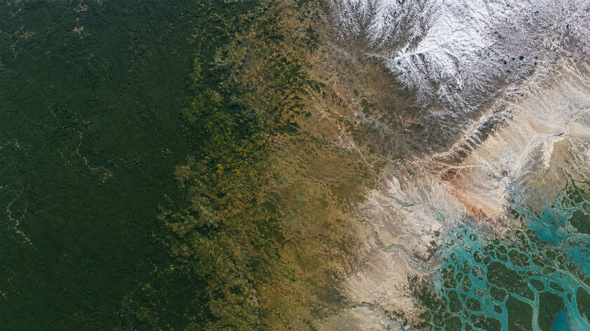

<div align="center">

# FairRSFM: A Biome-Aware Benchmark and Debiasing Framework for Remote Sensing Foundation Models

**Anonymous WACV 2027 Submission #2158**

[Paper PDF](assets/fairrsfm-paper.pdf) | [Revised LaTeX source](Paper___WACV_2027___FairRSFM/FairRSFM_revised.tex) | [Repository](https://github.com/aminurhossain/FairRSFM)

<br>



</div>

## Overview

Remote sensing foundation models (RSFMs) are commonly evaluated using aggregate metrics, but a single dataset-level score can hide systematic performance disparities across ecological regions. **FairRSFM** is a biome-aware benchmark and debiasing framework for studying ecological group robustness in RSFMs.

FairRSFM maps georeferenced samples from **14 terrestrial biome classes** into **six ecologically meaningful macro-groups** and evaluates models under a unified frozen-backbone probing protocol. The benchmark spans single-label classification, multi-label classification, crop-type segmentation, and dense land-cover segmentation.

Using Prithvi-EO-2.0, SatMAE, and DOFA, the benchmark shows that strong aggregate transfer performance can mask substantial biome-dependent gaps. It also evaluates mitigation strategies that operate without updating the RSFM backbone.

## News

- **August 2026:** FairRSFM repository and revised WACV 2027 manuscript released.
- **Code release:** Training, preprocessing, and evaluation code is being prepared for release in this repository.

## Highlights

- A biome-aware evaluation protocol for remote sensing foundation models.
- A deterministic mapping from 14 terrestrial biomes to six ecological macro-groups.
- Four downstream datasets spanning classification and semantic segmentation.
- Three representative frozen RSFM backbones: Prithvi-EO-2.0, SatMAE, and DOFA.
- Standard task metrics reported together with worst-group and cross-biome disparity measures.
- Biome-Orthogonal Linear Probing (BOLP), a closed-form representation-level mitigation method with no backbone updates or additional trainable parameters.
- Dynamic Biome Reweighting (DBR) and GroupDRO baselines for loss-level and group-robust comparison.

## Benchmark

### Downstream datasets

| Dataset | Task | Classes | Train | Val | Test | Primary metric |
|---|---|---:|---:|---:|---:|---|
| m-EuroSAT | Single-label classification | 10 | 2,000 | 1,000 | 1,000 | Macro-F1 |
| m-BigEarthNet | Multi-label classification | 43 | 20,000 | 1,000 | 1,000 | F1@opt |
| m-SA-Crop-Type | Semantic segmentation | 10 | 3,000 | 1,000 | 1,000 | mIoU |
| MMEarth20K | Dynamic World segmentation | 9 | 16,000 | 2,000 | 2,000 | mIoU |

### Frozen foundation models

| Backbone | Architecture | Parameters | Input bands | Encoder status |
|---|---|---:|---|---|
| Prithvi-EO-2.0 | Spatio-temporal ViT | 300M | 6 HLS bands | Frozen |
| SatMAE | ViT-Large | 304M | 10 Sentinel-2 bands | Frozen |
| DOFA | ViT-Base | 86M | 9-12 wavelength bands | Frozen |

All experiments use 224 x 224 inputs and are evaluated over three independent random seeds. Only the task-specific classification head or lightweight segmentation decoder is trained.

## Biome Groups

FairRSFM first assigns each georeferenced sample to one of 14 raw terrestrial biomes. These labels are then consolidated into six macro-groups that reflect major spectral, phenological, hydrological, cryospheric, and surface-property regimes.

| ID | Macro-group | Included raw biome IDs | Remote sensing rationale |
|---:|---|---|---|
| 1 | Aseasonal High-Biomass | 1, 3, 5 | Dense vegetation with persistent canopy structure |
| 2 | High-Amplitude Phenological | 2, 4, 6 | Forests with strong seasonal or phenological variation |
| 3 | Transitional Herbaceous and Scrub | 7, 8, 12 | Heterogeneous grass, shrub, soil, and canopy mixtures |
| 4 | Cryospheric and Short-Cycle | 10, 11 | Temperature-restricted ecosystems and short growing periods |
| 5 | Xeric and Mineralogical | 13 | Vegetation-sparse surfaces dominated by albedo and mineral background |
| 6 | Hydrologically Modulated | 9, 14 | Inundated ecosystems with water-driven spectral response |

<div align="center">
  
  <br>
  <sub>MMEarth20K sample distribution across the six macro-groups and the 80/10/10 train, validation, and test splits.</sub>
</div>

## Debiasing Framework

FairRSFM keeps the foundation-model encoder frozen and compares mitigation strategies at two stages of the downstream transfer pipeline.

### Dynamic Biome Reweighting

Dynamic Biome Reweighting (DBR) initializes inverse-frequency group weights and updates them from per-group validation performance. Groups performing below the current group mean receive greater weight at the next update.

### Biome-Orthogonal Linear Probing

Biome-Orthogonal Linear Probing (BOLP) acts directly on frozen embeddings:

1. Compute an embedding centroid for each biome macro-group.
2. Form the centered inter-group mean-difference matrix.
3. Estimate its dominant directions with a thin singular value decomposition.
4. Recenter each group and project embeddings onto the orthogonal complement of the biome-associated subspace.
5. Train the downstream head on the transformed features.

BOLP is closed-form, leaves the RSFM backbone unchanged, and adds no trainable parameters beyond the downstream head.

[View the full framework figure](assets/fairrsfm-framework.pdf)

## Main Results

The table below reports mean Prithvi-EO-2.0 performance over three seeds. Values are percentages. **Overall** is the standard task metric and **Worst** is the lowest score across the matched biome macro-groups.

| Dataset | Method | Overall | Worst | NFR (lower is better) |
|---|---|---:|---:|---:|
| m-EuroSAT | ERM | 90.98 | 83.72 | 5.96 |
|  | BOLP | 93.42 | 84.34 | 9.82 |
|  | DBR | 91.36 | **84.35** | **5.85** |
|  | GroupDRO | **94.14** | 84.34 | 10.34 |
| m-BigEarthNet | ERM | 60.09 | 46.12 | 31.14 |
|  | BOLP | **62.75** | **50.27** | 20.92 |
|  | DBR | 58.05 | 48.04 | 29.43 |
|  | GroupDRO | 54.42 | 46.82 | **19.19** |
| m-SA-Crop-Type | ERM | 27.30 | 18.47 | 35.31 |
|  | BOLP | **28.27** | 19.38 | 29.95 |
|  | DBR | 27.18 | **19.81** | **28.45** |
|  | GroupDRO | 28.26 | 19.09 | 39.63 |
| MMEarth20K | ERM | **47.99** | 33.75 | 28.19 |
|  | BOLP | 43.31 | 30.64 | 30.66 |
|  | DBR | 47.84 | 34.76 | 26.42 |
|  | GroupDRO | 46.99 | **37.16** | **15.34** |

### Key observations

- On **m-EuroSAT**, BOLP improves worst-group performance from 83.72% to 84.34% while increasing overall macro-F1 from 90.98% to 93.42%.
- On **m-BigEarthNet**, BOLP improves overall F1@opt from 60.09% to 62.75% and worst-group performance from 46.12% to 50.27%.
- On **m-SA-Crop-Type**, BOLP and DBR improve the weakest ecological group, with DBR reaching 19.81% worst-group mIoU.
- On **MMEarth20K**, mitigation is task dependent: GroupDRO produces the strongest worst-group mIoU, while BOLP removes representation directions that are also useful for dense prediction.

## Fairness and Robustness Metrics

FairRSFM reports standard task performance together with:

- Worst-group score (`M_worst`)
- Normalized performance range (`NFR`)
- Cross-group standard deviation
- Expected calibration error (`ECE`)
- Equalized odds difference (`EOdd`)
- Demographic parity measure (`DPM`)

Unknown, water-only, or unmatched samples are excluded from the primary worst-group summaries unless stated otherwise. Metrics are computed over the matched macro-groups present in each dataset split.

## Repository Structure

```text
FairRSFM/
|-- README.md
|-- assets/
|   |-- biome-hero.png
|   |-- fairrsfm-framework.pdf
|   |-- fairrsfm-paper.pdf
|   `-- macro-group-distribution.png
`-- Paper___WACV_2027___FairRSFM/
    |-- FairRSFM_revised.tex
    |-- FairRSFM_main.bib
    |-- model.pdf
    |-- macro_group_distribution.png
    `-- ...
```

The current repository snapshot contains the revised manuscript, figures, and release documentation. Training, preprocessing, and evaluation code will be added to the same repository.

## Paper

- [Read the paper](assets/fairrsfm-paper.pdf)
- [View the final revised LaTeX source](Paper___WACV_2027___FairRSFM/FairRSFM_revised.tex)
- [Browse all manuscript files](Paper___WACV_2027___FairRSFM)

## Citation

The manuscript is currently under anonymous review. A final citation with author information and publication metadata will be added after the review process.

```bibtex
@misc{anonymous2027fairrsfm,
  title  = {FairRSFM: A Biome-Aware Benchmark and Debiasing Framework for Remote Sensing Foundation Models},
  author = {Anonymous},
  note   = {Anonymous WACV 2027 submission},
  year   = {2027}
}
```

## Acknowledgements

FairRSFM builds on GEO-Bench, MMEarth, Dynamic World, the global terrestrial ecoregion taxonomy, and the official Prithvi-EO-2.0, SatMAE, and DOFA model releases.
